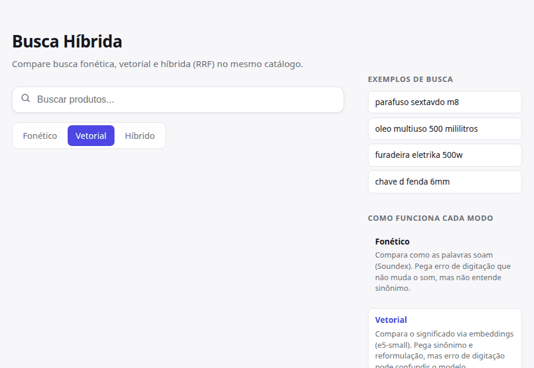
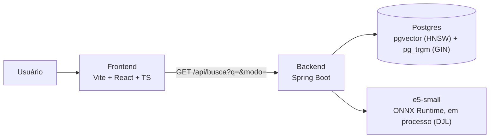

# Busca Híbrida

Motor de busca híbrida de produtos: busca fonética -> busca vetorial -> busca híbrida
(RRF), cada uma avaliada com números reais de Recall@10/MRR@10 sobre um catálogo
sintético propositalmente "sujo" (o tipo de dado que um catálogo real de e-commerce tem).



## Resultados

Recall@10 e MRR@10 sobre 70 queries rotuladas (`src/main/resources/eval/queries.json`)
contra o catálogo semente. Gerado pelo harness de avaliação (`EvalReportTest`), mesmas
70 queries pras três estratégias.

| Estratégia | Recall@10 | MRR@10 |
|---|---|---|
| fonética (soundex) | 1.0000 | 0.8579 |
| vetorial (e5-small) | 1.0000 | 1.0000 |
| híbrida (pg_trgm + RRF) | 1.0000 | 0.9643 |

Recall@10 bate 100% nas três porque o catálogo semente é pequeno (22 produtos, ~3-5 por
grupo) — o MRR@10 é onde a diferença aparece: fonética perde posição quando o código
Soundex de dois produtos do mesmo grupo colide, e a híbrida neste run ficou levemente
abaixo da vetorial pura porque o HNSW é um índice *aproximado* (a ordem exata pode variar
um pouco entre reindexações, o que se propaga pro ranking fundido por RRF). Nenhuma
correção foi feita pra forçar um resultado "mais bonito" — ver design.md da fase-3, que já
previa esse risco.

## Problema

Um catálogo de e-commerce real nunca é digitado de um jeito só. O mesmo produto aparece
com abreviações inconsistentes, erros de digitação, e a mesma unidade escrita de 5+
formas diferentes — e cada abordagem de busca tem um ponto cego diferente diante disso:

- **Busca lexical exata** erra sinônimo e reformulação ("óleo multiuso" não bate com
  "lubrificante" mesmo sendo o mesmo produto).
- **Busca vetorial (embeddings)** entende significado, mas um erro de digitação pode
  distorcer o vetor o suficiente pra confundir o modelo — embeddings borram significado,
  não corrigem grafia.
- **Busca de trigrama (`pg_trgm`)** pega erro de digitação de frente, mas não entende
  sinônimo nenhum.

Este projeto mostra as três abordagens lado a lado — fonética, vetorial e híbrida (RRF)
— cada uma avaliada com Recall@10/MRR@10 reais sobre o mesmo catálogo sujo, pra deixar
visível o trade-off de cada uma em vez de só escolher uma e seguir em frente.

### Padrões de sujeira do dataset semente

O catálogo semente (`src/main/resources/db/migration/V2__seed_catalog.sql`) inclui
deliberadamente:

- [x] **Abreviações inconsistentes** — o mesmo termo escrito por extenso e abreviado
  (`sextavado` / `sext.` / `SEXTAVADO`, `elétrica` / `elétr.`).
- [x] **Erros de digitação** — letra faltando, duplicada ou trocada (`sextavdo`,
  `borrachaa`, `eletrika`).
- [x] **5+ variações da mesma unidade** — o mesmo volume (500 ml) escrito de pelo menos
  5 formas diferentes: `500ml`, `500 ml`, `0,5L`, `500 mililitros`, `meio litro`.

## Arquitetura



- **Backend** (Spring Boot / Java 21): expõe `GET /api/busca?q=&modo=fonetico|vetorial|hibrido`
  (default `vetorial`), `POST /embed` (embedding cru) e `POST /api/index` (reindexação
  manual). Reindexa o catálogo automaticamente no startup, então um `docker compose up`
  de clone limpo já sobe com tudo pesquisável — sem esse passo, embedding/texto_busca
  ficam `NULL` e os modos vetorial/híbrido voltam vazios.
- **Normalização** (`TextNormalizer`): lowercase, remoção de acento, e expansão de
  abreviações conhecidas (`abbreviations.json`) — a mesma função roda tanto ao indexar
  produtos quanto ao processar a query, gerando o `texto_busca` usado pelo `pg_trgm`.
- **Embeddings**: e5-small (384 dimensões) rodando em processo na JVM via DJL + ONNX
  Runtime — sem depender de um serviço Python externo. Prefixo assimétrico do e5:
  `"passage: "` na indexação, `"query: "` na busca.
- **Banco**: Postgres 16 com duas extensões complementares — `pgvector` (índice HNSW,
  distância de cosseno) pra busca vetorial, e `pg_trgm` (índice GIN de trigrama) pra
  busca lexical tolerante a erro de digitação.
- **As três estratégias de busca**:
  - *Fonética* (Soundex) — ranqueia por quantos tokens da query têm o mesmo código
    fonético de algum token do produto.
  - *Vetorial* — ordena por distância de cosseno contra o índice HNSW.
  - *Híbrida* — recupera top-50 candidatos lexicais (`pg_trgm`) e top-50 vetoriais, funde
    os dois rankings com Reciprocal Rank Fusion (`score = Σ 1/(k+rank)`, k=60), e expõe o
    rank de origem de cada resultado em cada ranking.
- **Avaliação** (`EvalRunner`/`Metrics`): calcula Recall@10 e MRR@10 sobre 70 queries
  rotuladas (`src/main/resources/eval/queries.json`) contra uma estratégia plugável —
  reaproveitado sem mudança pras três estratégias (ver tabela abaixo).
- **Frontend** (Vite + React + TypeScript): campo de busca com debounce, toggle dos três
  modos (reconsulta ao trocar), lista de resultados com os scores do modo ativo, e uma
  barra lateral com exemplos de busca e a explicação de cada modo.
- **Empacotamento**: um único `docker-compose.yml` sobe Postgres, backend e frontend
  (build multi-stage, servido por nginx, que faz proxy de `/api` pro backend).
- **Docs de API**: Swagger UI (`/swagger-ui.html`) e OpenAPI 3.1 (`/v3/api-docs`), geradas
  a partir dos controllers via `springdoc-openapi`.

## Rodando localmente

```bash
docker compose up
```

Sobe Postgres (com `pgvector`+`pg_trgm` habilitados), o backend (porta 8080) e o
frontend (porta 8082) juntos — a migration Flyway cria o schema, carrega o catálogo
semente, e o backend reindexa tudo automaticamente no startup. Nenhum passo manual
adicional.

- Frontend: http://localhost:8082
- API: http://localhost:8080/api/busca?q=parafuso+sextavado+m8&modo=hibrido
- Swagger UI: http://localhost:8080/swagger-ui.html

```bash
curl -X POST localhost:8080/embed -H 'Content-Type: application/json' \
  -d '{"text": "parafuso sextavado M8"}'
```
